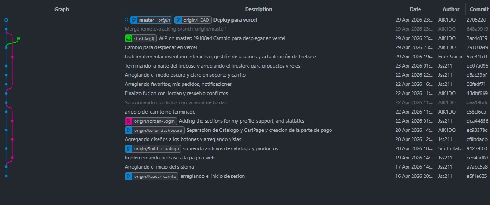

<div align="center">


# TechVault

### Sistema de Gestión Tecnológica

Plataforma web de e-commerce y gestión de inventario para productos tecnológicos,
construida con React, Firebase y Tailwind CSS.

<br/>

[](https://react.dev)
[](https://vitejs.dev)
[](https://firebase.google.com)
[](https://tailwindcss.com)
[](https://vercel.com)

<br/>

[Ver Demo](https://sistema-de-gestion.vercel.app) · [Reportar Bug](https://github.com/Jss211/sistema-de-gestion/issues) · [Contribuir](https://github.com/Jss211/sistema-de-gestion/pulls)

</div>

---

## Historial de desarrollo



---

## Funcionalidades

<table>
<tr>
<td width="50%">

**Usuarios**

- Catalogo con busqueda, filtros por categoria y paginacion
- Carrito de compras con gestion de cantidades
- Proceso de pago: Visa, Yape, BCP, Scotiabank
- Ticket de compra imprimible
- Favoritos sincronizados en tiempo real
- Historial de pedidos con estado de cada orden
- Notificaciones automaticas al comprar
- Perfil editable con foto, datos y direccion
- Modo oscuro / claro persistente
- Panel de estadisticas con graficos

</td>
<td width="50%">

**Administradores**

- Gestion de productos: agregar, editar y eliminar en Firestore
- Gestion de usuarios: cambio de roles (admin / cliente)
- Migracion automatica del catalogo local a Firestore
- Rutas protegidas por rol leido desde Firestore
- Reglas de seguridad en Firestore por rol

</td>
</tr>
</table>

---

## Tecnologias

| Tecnologia | Version | Uso |
|---|---|---|
| React | 19 | UI principal |
| Vite | 8 | Bundler y dev server |
| Tailwind CSS | 4 | Estilos utilitarios |
| Firebase Auth | 12 | Autenticacion con Google y email |
| Firestore | 12 | Base de datos en tiempo real |
| React Router | 7 | Navegacion SPA |
| Recharts | 3 | Graficos de estadisticas |
| GSAP | 3 | Animaciones |
| Heroicons | 2 | Iconografia |
| Motion | 12 | Animaciones declarativas |

---

## Estructura del proyecto

```
sistema-de-gestion/
├── public/
│   ├── favicon.svg
│   ├── icons.svg
│   └── payment-logos/          # Logos de metodos de pago
├── src/
│   ├── components/
│   │   ├── dashboard/          # Hero, Metricas, Beneficios, Garantias, Stats, CTA
│   │   ├── estadisticas/       # KpiCards, TransaccionesChart, CategoriasChart, etc.
│   │   ├── AuthModal.jsx
│   │   ├── AuthSection.jsx
│   │   ├── PaymentMethodsSection.jsx
│   │   └── SpecialOffersSection.jsx
│   ├── data/
│   │   └── productos.json      # Catalogo local (fallback y migracion inicial)
│   ├── hooks/
│   │   └── useTheme.js         # Hook para tema oscuro/claro
│   ├── pages/
│   │   ├── admin/
│   │   │   ├── AgregarProducto.jsx   # CRUD de productos
│   │   │   └── Usuarios.jsx          # Gestion de roles
│   │   ├── Carrito.jsx
│   │   ├── Catalogo.jsx
│   │   ├── Dashboard.jsx
│   │   ├── Estadisticas.jsx
│   │   ├── Favoritos.jsx
│   │   ├── MiPerfil.jsx
│   │   ├── MisPedidos.jsx
│   │   ├── Notificaciones.jsx
│   │   ├── Sidebar.jsx
│   │   └── Soporte.jsx
│   ├── services/
│   │   └── statsService.js     # Capa de datos para estadisticas
│   ├── App.jsx                 # Rutas con proteccion por rol
│   ├── firebase.js             # Configuracion de Firebase
│   └── main.jsx                # Entrada 
├── vercel.json                 # Rewrite para React Router en Vercel
└── firestore.rules             # Reglas de seguridad Firestore
```

---

## Instalacion

```bash
# Clonar el repositorio
git clone https://github.com/Jss211/sistema-de-gestion.git
cd sistema-de-gestion

# Instalar dependencias
npm install

# Iniciar servidor de desarrollo
npm run dev
```

---

## Firebase

El proyecto utiliza tres servicios de Firebase:

- **Authentication** — login con Google y correo/contraseña
- **Firestore** — colecciones `productos` y `users`
- **Storage** — fotos de perfil de usuario

**Reglas de Firestore**

```
/users/{userId}
  - Lectura: cualquier usuario autenticado
  - Escritura: el propio usuario sobre su documento
  - Actualizacion: solo admins

/productos/{productoId}
  - Lectura: publica (sin autenticacion)
  - Escritura: solo admins
```

---

## Deploy

El archivo `vercel.json` configura el rewrite necesario para que React Router funcione en Vercel. Sin esto, rutas como `/admin/productos` devuelven 404 al refrescar o acceder directamente.

```json
{
  "rewrites": [
    { "source": "/(.*)", "destination": "/index.html" }
  ]
}
```

---

## Scripts

```bash
npm run dev       # Servidor de desarrollo con HMR
npm run build     # Build de produccion
npm run preview   # Preview del build local
npm run lint      # Linter con ESLint
```

---

## Equipo

<div align="center">

| Autor | Contribucion principal |
|---|---|
| Jss211 | Arquitectura, Firebase, rutas, carrito, perfil, notificaciones |
| AIK1DO | Dashboard, fusion de ramas, deploy |
| EderPaucar | Inventario interactivo, gestion de usuarios |
| Smith Bal. | Catalogo y productos |
| Jordan | Login y autenticacion |
| Paucar | Carrito y proceso de pago |

</div>

---

<div align="center">

**TechVault** — Sistema de Gestion Tecnologica

</div>
