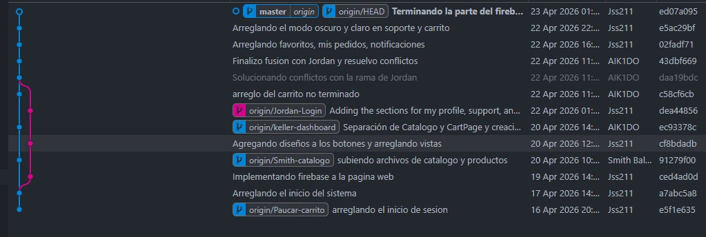

<h1 align="center">Sistema de Gestión de Productos Tecnológicos</h1>

<p align="center">
  Plataforma e-commerce con panel de análisis de inventario en tiempo real
</p>

<p align="center">
  
  
  
  
</p>

## Descripción

Sistema web de gestión y venta de productos tecnológicos desarrollado con React y Firebase. Permite a los usuarios explorar un catálogo de productos (laptops, PCs, periféricos, monitores, accesorios y almacenamiento), realizar compras y gestionar sus pedidos de forma intuitiva.

El sistema integra un panel de análisis de inventario con métricas en tiempo real y un sistema de roles (usuario y administrador) que permite controlar el acceso a funcionalidades específicas.

---

## Objetivos del Sistema

- Facilitar la venta de productos tecnológicos en línea
- Proporcionar control y monitoreo del inventario
- Mejorar la experiencia del usuario en el proceso de compra
- Permitir la gestión eficiente de productos por parte del administrador

---

## Tecnologías Utilizadas

| Tecnología | Uso |
|----------|------|
| React (JSX) | Desarrollo del frontend |
| Firebase | Base de datos y backend |
| Firebase Authentication | Autenticación de usuarios |
| JavaScript | Lógica del sistema |
| CSS | Estilos y diseño |

---

## Funcionalidades Principales

### Catálogo de Productos

- Visualización de productos disponibles
- Información detallada:
  - Nombre
  - Precio
  - Stock
  - Imagen (mediante URL)
  - Descripción
  - Rating y reseñas
- Acciones disponibles:
  - Agregar al carrito
  - Agregar a favoritos

---

### Carrito de Compras

- Gestión dinámica de productos
- Cálculo automático del total
- Métodos de pago disponibles:
  - Tarjeta (Visa / Débito)
  - Yape
  - BCP
  - Scotiabank

---

### Mis Pedidos

- Historial completo de compras realizadas
- Funcionalidades:
  - Visualización de detalles del pedido
  - Recompra de productos
  - Generación de ticket de compra (imprimible)

---

### Favoritos

- Lista personalizada de productos marcados por el usuario
- Acceso rápido a productos de interés

---

### Notificaciones

Sistema de notificaciones en tiempo real clasificado por categorías:

- Pedidos
- Pagos
- Ofertas
- Sistema

Funciones disponibles:
- Visualizar todas las notificaciones
- Filtrar por tipo
- Marcar como leídas
- Limpiar historial

Ejemplo:
> Pago confirmado: Tu pedido fue registrado correctamente.

---

### Perfil de Usuario

Gestión de información personal:

- Foto de perfil
- Nombre completo
- Nombre de usuario
- Correo electrónico
- Teléfono
- Dirección de envío

Información adicional:
- Fecha de registro
- Total de compras realizadas

---

### Soporte

- Envío de consultas o incidencias
- Canal de comunicación con el sistema

---

### Panel de Análisis de Inventario

Dashboard con métricas clave para la toma de decisiones:

- Total de productos
- Stock total
- Valor del inventario
- Productos con stock bajo
- Transacciones semanales
- Ventas mensuales
- Evolución anual de ventas
- Distribución por categorías
- Top 5 productos más valiosos
- Estado del inventario
- Comparativa mensual de ventas

---

## Roles del Sistema

### Usuario

- Explorar catálogo
- Comprar productos
- Gestionar carrito
- Visualizar pedidos
- Administrar favoritos
- Editar perfil

---

### Administrador

Incluye todas las funcionalidades del usuario, además de:

- Gestión de productos:
  - Crear
  - Editar
  - Eliminar
- Configuración de productos:
  - Precio
  - Stock
  - Imagen (URL)
  - Descripción
  - Rating y reseñas

---

## Estructura del Proyecto

```text
src/
├── components/
│   ├── AuthModal.jsx
│   ├── AuthSection.jsx
│   ├── CountUp.jsx
│   ├── GlareHover.jsx
│   ├── GradientText.jsx
│   ├── PaymentMethodsSection.jsx
│   ├── SpecialOffersSection.jsx
│   ├── StarBorder.jsx
│   ├── TextType.jsx
│   ├── dashboard/
│   │   ├── BenefitsSection.jsx
│   │   ├── CtaSection.jsx
│   │   ├── GuaranteesSection.jsx
│   │   ├── HeroSection.jsx
│   │   ├── MetricsSection.jsx
│   │   ├── StatsSection.jsx
│   │   └── WelcomeAlert.jsx
│   └── estadisticas/
│       ├── CategoriasChart.jsx
│       ├── InventarioMensualChart.jsx
│       ├── KpiCards.jsx
│       ├── ProductosValorChart.jsx
│       ├── TransaccionesChart.jsx
│       └── VentasMensualesChart.jsx
├── data/
│   └── productos.json
├── hooks/
│   └── useTheme.js
├── pages/
│   ├── Carrito.jsx
│   ├── Catalogo.jsx
│   ├── Dashboard.jsx
│   ├── Estadisticas.jsx
│   ├── Favoritos.jsx
│   ├── MiPerfil.jsx
│   ├── MisPedidos.jsx
│   ├── Notificaciones.jsx
│   ├── Sidebar.jsx
│   └── Soporte.jsx
├── services/
│   └── statsService.js
├── firebase.js
├── App.jsx
├── main.jsx
└── index.css
```
----------------------------------------------

### Flujo del Sistema
El usuario accede a la plataforma 
Se autentica (Google o correo electrónico)
Explora el catálogo de productos
Agrega productos al carrito
Realiza el pago
Se registra el pedido en el sistema
Recibe una notificación de confirmación
Puede consultar su historial o generar su ticket

### Consideraciones Técnicas
Uso de URLs para imágenes para optimizar el almacenamiento en Firebase
Firebase gestiona:
Autenticación
Base de datos
Arquitectura modular basada en componentes reutilizables
Separación de lógica mediante servicios (statsService)

## GRAFICO DE PARTICIPACION

<p align="center">
  
</p>
<p align="center">
  <sub>Participantes del trabajo</sub>
</p>
